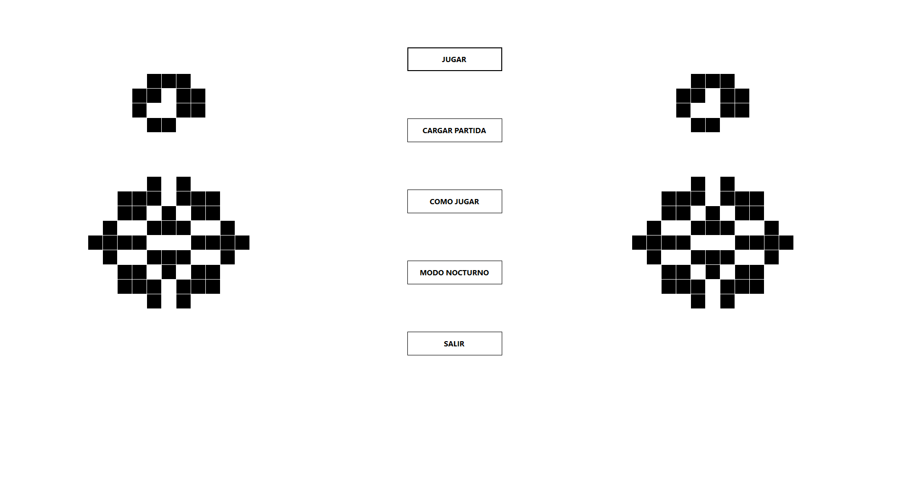
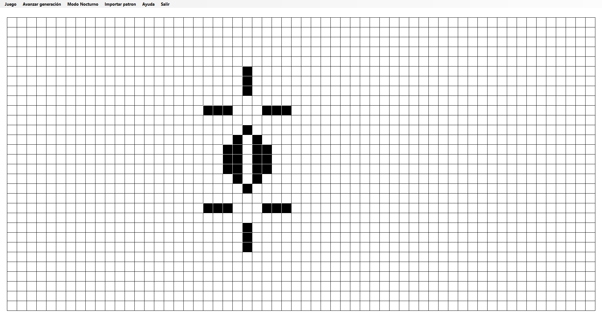
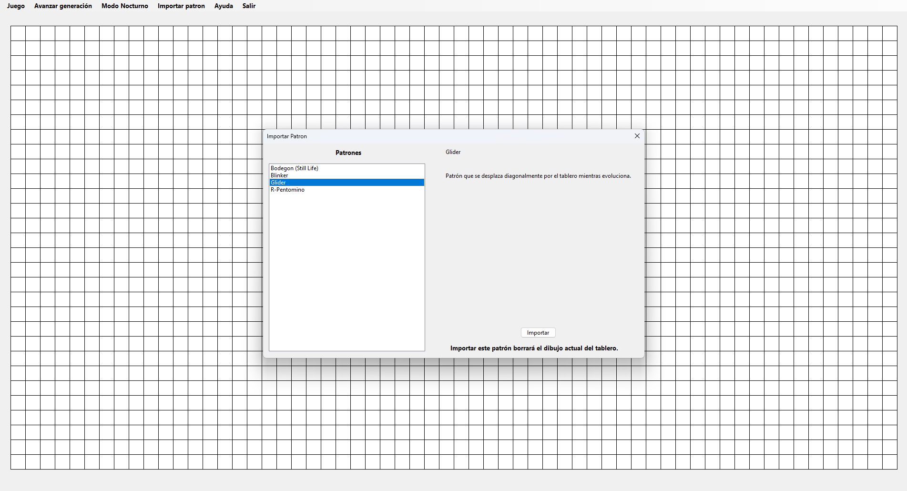
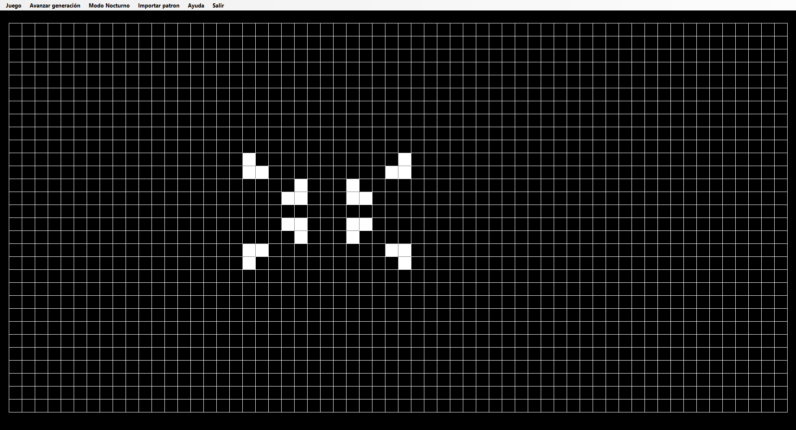

# El Juego de la Vida

Implementación del Juego de la Vida de John Horton Conway desarrollada en C# como proyecto académico durante el primer curso del ciclo de Desarrollo de Aplicaciones Multiplataforma (DAM).

## Tecnologías

- C#
- .NET
- Windows Forms
- Git

## Descripción

El proyecto consiste en una implementación del Juego de la Vida, un autómata celular ideado por el matemático John Horton Conway.

La aplicación permite trabajar con un tablero de células y simular su evolución generación tras generación siguiendo las reglas del juego.

Además, cuenta con un menú desde el que el usuario puede seleccionar e implementar diferentes patrones sobre el tablero. El objetivo es facilitar la experimentación con algunas de las configuraciones más conocidas del Juego de la Vida y descubrir cómo evolucionan a lo largo de la simulación.

## Funcionalidades

### Menú principal

- **Iniciar partida:** acceso a los diferentes modos de simulación.
- **Cargar partida:** permite recuperar partidas guardadas previamente.
- **Modo nocturno:** permite cambiar entre el modo normal y el modo nocturno, manteniendo la configuración al cambiar entre las diferentes pantallas de la aplicación.
- **Salir:** cierre de la aplicación.

### Simulación

- **Simulación manual:** permite al usuario interactuar con el tablero y controlar la evolución de la partida.
- **Simulación automática:** ejecuta la evolución de las generaciones de forma automática.
- **Guardar partida:** permite guardar el estado actual de una partida.
- **Cargar partida:** permite recuperar una partida guardada.
- **Importar patrones:** permite incorporar diferentes patrones al tablero para experimentar con su evolución.
- **Reglas:** acceso a las reglas del Juego de la Vida.
- **Acerca de:** proporciona información adicional sobre el Juego de la Vida mediante contenido externo.

## Objetivos del proyecto

- Aplicar conceptos de programación orientada a objetos.
- Trabajar con clases y estructuras en C#.
- Implementar la lógica de evolución de las células.
- Desarrollar una interfaz gráfica utilizando Windows Forms.
- Implementar y gestionar diferentes patrones dentro del tablero.
- Trabajar con Git y control de versiones.
- Realizar la documentación del proyecto.

## Ejecución

1. Clonar el repositorio.
2. Abrir `ElJuegoDeLaVida.slnx` con Visual Studio.
3. Compilar y ejecutar el proyecto.

## Capturas de pantalla

### Menú principal

### Simulación

### Importar patrones

### Modo nocturno

## Autor

**Brian Falcon Tirella (TirellaZzz)**

Proyecto académico realizado durante el primer curso de DAM.
